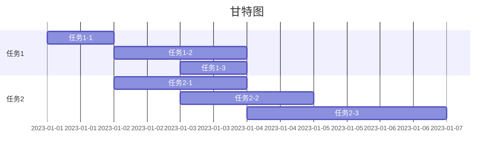
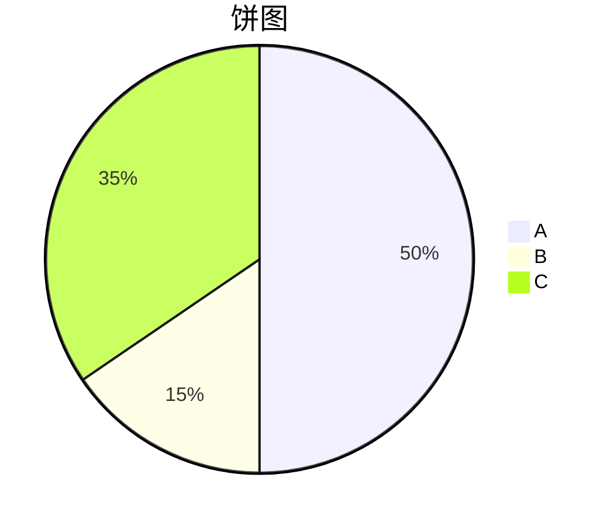
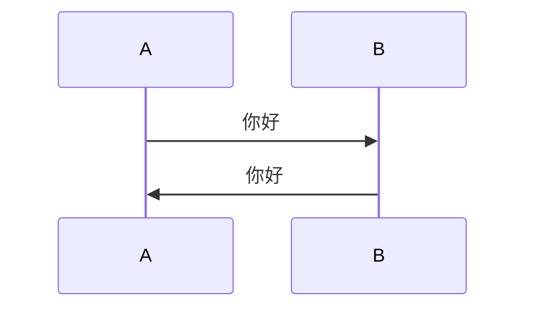

## 二级标题

### 三级标题

#### 四级标题

##### 五级标题

> 引用
>
> 我很神秘
>
> 我很NB
>
> 你也很NB
>
> 功能A
>
> 这是来自test branch的内容
>
> 这是在分支上继续修改的内容

> 我寻思这边更厉害一些123456

> 并非并非
>
> **加粗**
>
> *斜体*
>
> ~~删除线~~
>
> _下划线_

`行内代码`

分隔线1

***

分隔线2

***

1. 有序列表
2. 有序列表2
3. 有序列表3

- 无序列表
- 无序列表2
- 无序列表3
- [ ] &#x20;代办事项
- [x] &#x20;代办事项2
- [x] &#x20;代办事项3

```
这是一个代码块
```

```js
这是一个JavaScript代码块
```

表格

| 列1 | 列2    | 列3    |
| -- | ----- | ----- |
| 行1 | 行1-列1 | 行1-列2 |
| 行2 | 行2-列1 | 行2-列2 |
| 行3 | 行3-列1 | 行3-列2 |

mermaid流程图


mermaid甘特图



mermaid饼图



mermaid时序图



